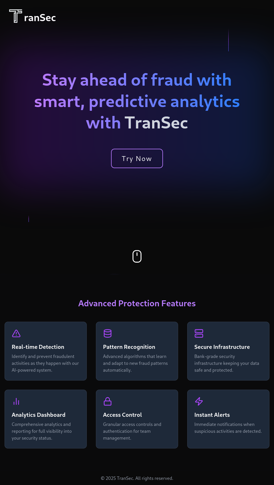

# TranSec: Real-Time Fraud Detection

**Hackathon Project**: An AI-based system to detect and block financial fraud in real-time by analyzing transaction patterns.

**Problem Statement**: Design an AI system for real-time fraud detection using transaction patterns, ensuring secure financial operations.

**GitHub**: [foskey51/fintech-404](https://github.com/foskey51/fintech-404)

## Screenshots
| Image | 
|-------|
|  | 
|  | 
| **** | 
|  | 
|  |

## Overview
TranSec uses a LightGBM model to predict fraud in financial transactions, providing real-time insights with SHAP explanations. The frontend, built with Next.js, displays a dashboard with transaction analytics, while the Flask backend serves predictions via a `/predict` endpoint. Trained on the [Kaggle Fraudulent Transactions Dataset](https://www.kaggle.com/datasets/chitwanmanchanda/fraudulent-transactions-data).

## Features
- **Real-Time Detection**: Classifies transactions as Fraud, Legitimate, or Manual Review.
- **Explainability**: SHAP-based feature importance for each prediction.
- **Interactive Dashboard**: Visualizes fraud metrics with a bar chart and transaction table.
- **Scalable Backend**: Flask API with Docker support.

## Dataset
The model is trained on the [Kaggle Fraudulent Transactions Dataset](https://www.kaggle.com/datasets/chitwanmanchanda/fraudulent-transactions-data):
- **Columns**:
  - `step`: Unit of time (1 step = 1 hour, 744 steps = 30 days).
  - `type`: CASH-IN, CASH-OUT, DEBIT, PAYMENT, TRANSFER.
  - `amount`: Transaction amount in local currency.
  - `nameOrig`: Originating customer (dropped during training/prediction).
  - `oldbalanceOrg`: Sender’s balance before transaction.
  - `newbalanceOrig`: Sender’s balance after transaction.
  - `nameDest`: Recipient customer (dropped during training/prediction).
  - `oldbalanceDest`: Recipient’s balance before transaction.
  - `newbalanceDest`: Recipient’s balance after transaction.
- **Note**: `nameOrig` and `nameDest` are optional and excluded from model training and predictions.

## Features

* Fraud detection using machine learning on a Kaggle dataset
* API endpoint for predicting fraudulent transactions
* Frontend built with Next.js, Framer Motion, and Chart.js
* Backend built with Flask, LightGBM, SHAP, and Pandas

## Technologies Used

* Python 3.8+
* Flask
* LightGBM
* SHAP
* Pandas
* Framer Motion
* Chart.js
* Tailwind CSS
* Vite

# Setup
### Frontend

1. Install dependencies:
```bash
npm install
```
2. Run the server:
```bash
npm run dev
```
### Backend
### Linux/Mac (via Terminal)

1. Open a terminal.
2. Create a new virtual environment named `fraud-404-env`.
3. Activate the environment using:
    ```
    source fraud-404-env/bin/activate  # Linux/Mac
    .fraud-404-env\Scripts\activate  # Windows
    ```

### Windows (via Command Prompt)

1. Open a command prompt.
2. Create a new virtual environment named `fraud-404-env`.
3. Activate the environment using:
    ```
    \fraud-404-env\Scripts\activate
    ```

## Installing Dependencies

1. Install required dependencies by running:
    ```
    bash
    pip install -r requirements.txt
    ```

### API Endpoint

* URL: http://localhost:5000/predict
* Method: POST
* Example request body:
```json
[
  {
    "step": 1,
    "type": "TRANSFER",
    "amount": 1000,
    "oldbalanceOrg": 5000,
    "newbalanceOrig": 4000,
    "oldbalanceDest": 1000,
    "newbalanceDest": 2000
  }
]
```
Response:
```json
[
  {
    "explanation": [
      {"feature": "newbalanceOrig", "impact": -7.5938},
      {"feature": "type", "impact": 1.1688},
      {"feature": "oldbalanceOrg", "impact": -1.1001}
    ],
    "fraud_probability": 0.04,
    "prediction": 0,
    "status": "Legitimate"
  }
]
```
